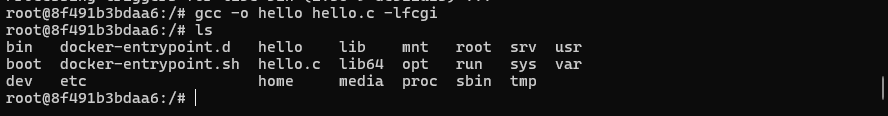
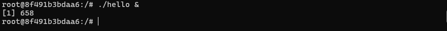

# Docker

## Часть 1. Готовый докер

После установки linux на Virtualbox решил сразу пробросить порты 80, 443 и для подключения по ssh 22 порт

Подключаюсь к linux по ssh

Скачал официальный докер-образ с **nginx** при помощи `docker pull`.

Проверил наличие докер-образа через `docker images`.

Запустил докер-образ через `docker run -d [image_id|repository]`.

Проверил, что образ запустился через `docker ps`.

Нужно посмотреть информацию о контейнере через `docker inspect [container_id|container_name]`. По выводу команды определить размер контейнера, список замапленных портов и ip контейнера. Размер `docker ps -s`

`sudo docker inspect f0cd83c609a4` Видим IP Adress 172.17.0.2

`"80/tcp": null` в выводе `docker inspect` означает, что порт 80 контейнера НЕ замаплен (не проброшен) на порт хост-машины. Просто слушает порт 80 внутри контейнера.

Остановил докер контейнер через `sudo docker stop f0cd83c609a4`. Проверил, что контейнер остановился через `sudo docker ps`.

Запустил докер с портами 80 и 443 в контейнере, замапленными на такие же порты на локальной машине, через команду *run*. Дал имя part1, чтобы самому не запутаться в контейнерах.

Проверил, что в браузере по адресу *localhost:80* доступна стартовая страница **nginx**.

Перезапустил докер контейнер через `sudo docker restart dbc0253532e5`. Проверил, что контейнер запустился

## Часть 2. Операции с контейнером

Остановил предыдущий контейнер из части 1, чтобы он не занимал порты, запустил новый с именем part2

Прочитал конфигурационный файл *nginx.conf* внутри докер контейнера через команду *exec*.

`sudo docker exec -it part2 cat etc/nginx/nginx.conf`

Создал на локальной машине файл *nginx.conf*.

Скопировал созданный файл *nginx.conf* внутрь докер-образа через команду `docker cp`.

` sudo docker cp nginx.conf f60eac816915:etc/nginx/nginx.conf`

Перезапустил nginx внутри докер образа через команду exec

`sudo docker exec f60eac816915 nginx - s reload`

Проверил, что по адресу *localhost:80/status* отдается страничка со статусом сервера **nginx**.

**`accepts` (10)** — общее количество **принятых** соединений с момента запуска Nginx.

**`handled` (10)** — количество **успешно обработанных** соединений.

**`requests` (11)** — общее количество **обработанных HTTP-запросов**.

Чтобы каждый раз не писать sudo применяем команды

`sudo groupadd docker`

`sudo usermod -aG docker brittanb`

`newgrp docker`

перезагрузить виртуалку

Экспортировал контейнер в файл *container.tar* через команду *export*.

`docker export f60eac816915 > container.tar`

Остановил контейнер

*Нельзя удалить образ, если он используется контейнером (даже остановленным)*

Удалил контейнеры `docker rm`

Удалил образ через `docker rmi [image_id|repository]`

Импортировал контейнер обратно через команду *import*.

Запусти импортированный контейнер.

* `nginx` — запускает веб-сервер
* `-g "daemon off;"` — запускает nginx в foreground режиме (обязательно для Docker). Без этого флага nginx запустится в фоне и контейнер сразу завершится

Проверил, что по адресу *localhost:80/status* отдается страничка со статусом сервера **nginx**.

## Part 3. Мини веб-сервер

Нужно написать мини-сервер на **C** и **FastCgi**, который будет возвращать простейшую страничку с надписью `Hello World!`. Он есть в папке materials

Нужно написать свой *nginx.conf*, который будет проксировать все запросы с 81 порта на *127.0.0.1:8080*.

Запускаем nginx на порт 81

Переходим в папку 3 части, копируем файлы в docker контейнер

Заходим в контейнер

Устанавливаем spawn-fcgi

устанавливаем libfcgi-dev

устанавливаем gcc

компилируем файл

запускаем spawn-fcgi. Без `&` терминал будет заблокирован до завершения программы

перезапускаем nginx

проверяем нашу страничку

## Part 4. Свой докер

Создадим свой образ

из папки 04 выполняем команду `docker build -t my-fastcgi-server:part4 . `

Запусти собранный докер-образ с маппингом 81 порта на 80 на локальной машине и маппингом папки *./nginx* внутрь контейнера по адресу, где лежат конфигурационные файлы **nginx**'а

Проверил, что по localhost:80 доступна страничка написанного мини сервера.

Дописал в *./nginx/nginx.conf* проксирование странички */status*, по которой надо отдавать статус сервера **nginx**.

Перезапустил докер-образ.

Проверил, что теперь по *localhost:80/status* отдается страничка со статусом **nginx**

## Part 5. **Dockle**

Просканируй образ из предыдущего задания через `dockle [image_id|repository]`.

с помощью команды docker run --rm -v /var/run/docker.sock:/var/run/docker.sock goodwithtech/dockle my-fastcgi-server:1.0 проверяем образ

Исправляем образ, используем образ alpine. Переписываем под alpine команды, прописываем healtcheck

Собираем образ заново

Эта информация гласит, что я проверяю образом который не имеет подписи, к нашему образу это не относится

**Образ `fastcgi-server:part4` прошел проверку** - критических уязвимостей нет

Dockle рекомендует включить **Content Trust** для повышения безопасности

включается командой `export DOCKER_CONTENT_TRUST=1`

## Part 6. Базовый **Docker Compose**

1. **fastcgi-app** слушает порт 81 во внутренней сети
2. **nginx-proxy** проксирует с порта 8080 на fastcgi-app:81
3. Порт 8080 nginx-proxy мапится на порт 80 хоста

Написал файл *docker-compose.yml*

создаем конфиг для сервер проксирования с 8080 на 81 порт

